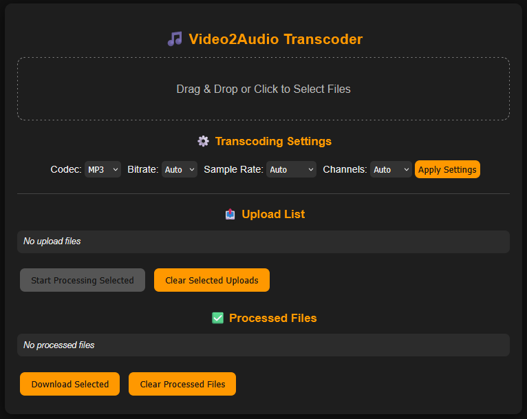

# Video2Audio Transcoder

A simple web application to **convert video files to audio** in various formats with custom settings. Built with **Flask** and **FFmpeg**, it supports drag-and-drop uploads, batch processing, and downloading processed audio.

---

## Features

- Convert video files to audio formats: **MP3, AAC, FLAC, WAV**
- Configure **bitrate, sample rate, and channels** per file
- Batch upload and processing
- Download processed files directly from the browser
- Automatic detection of lossless vs lossy formats
- Friendly UI with real-time status updates

---

## Web UI



---

## Installation

1. **Clone the repository**
```bash
git clone https://github.com/trholy/video2audio.git
cd video2audio
````

2. **Build and run the app with Docker**

```bash
docker compose up --build
```

3. **Access the app:** Open your browser and go to [http://127.0.0.1:5000](http://127.0.0.1:5000)

---

## Usage

1. Drag and drop video files into the upload area or click to select files.
2. Configure your desired audio **codec**, **bitrate**, **sample rate**, and **channels**.
3. Click **Apply Settings**.
4. Select files to process and click **Start Processing**.
5. Once processed, click **Download Selected** to save the audio files.

---

## Folder Structure

```
video2audio/
├── .dockerignore
├── .gitignore
├── Dockerfile
├── LICENSE
├── README.md
├── docker-compose.yml
├── img
│   └── app_screenshot.png
├── processed
│   └── .gitkeep
├── processing
│   └── .gitkeep
├── setup.py
├── src
│   └── video2audio
│       ├── __init__.py
│       ├── app.py
│       ├── cli.py
│       ├── static
│       │   ├── css
│       │   │   └── style.css
│       │   └── js
│       │       └── main.js
│       ├── templates
│       │   └── index.html
│       └── transcoder.py
└── uploads
    └── .gitkeep
```

---

## License

This project is licensed under the MIT License. See the [LICENSE](LICENSE) file for details.

